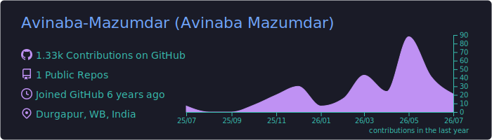

### Hi there 👋

I'm Avinaba Mazumdar, a Mid-Senior Frontend Engineer.

- 🔭 I’m currently working on web dev projects with React Native and FastAPI
- 🌱 I’m currently learning AI Full-Stack Development
- 😄 Pronouns: He/Him
<!--
- 👯 I’m looking to collaborate on ...
- 🤔 I’m looking for help with ...
- 💬 Ask me about ...
- 📫 How to reach me: ...
- ⚡ Fun fact: ...
-->

 

<!-- ======= VISITOR COUNT ======= -->

  

### 📊 GitHub Analytics

#### 📈 Activity & Streaks

  
  

  

#### 🧮 Language Statistics

<table>
  <thead>
    <tr>
      <th align="left">Language</th>
      <th align="left">Stack Distribution</th>
    </tr>
  </thead>
  <tbody>
    <!-- TypeScript -->
    <tr>
      <td><b>TypeScript</b></td>
      <td>
        
        🟦🟦🟦🟦
      </td>
    </tr>
    <!-- JavaScript -->
    <tr>
      <td><b>JavaScript</b></td>
      <td>
        
        🟨🟨🟨🟨
      </td>
    </tr>
    <!-- React & NextJS -->
    <tr>
      <td><b>React & NextJS</b></td>
      <td>
        
        
         
        🟦⬛🟦⬛🟦
      </td>
    </tr>
    <!-- Hono.js -->
    <tr>
      <td><b>Hono.js</b></td>
      <td>
        
        🟧🟧
      </td>
    </tr>
    <!-- Astro -->
    <tr>
      <td><b>Astro</b></td>
      <td>
        
        ◻️◻️
      </td>
    </tr>
    <!-- FastAPI -->
    <tr>
      <td><b>FastAPI</b></td>
      <td>
        
        🟩🟩
      </td>
    </tr>
    <!-- Svelte & SvelteKit -->
    <tr>
      <td><b>Svelte & SvelteKit</b></td>
      <td>
        
        🟧
      </td>
    </tr>
    <!-- HTML5 & CSS3/SCSS -->
    <tr>
      <td><b>HTML5 & CSS3/SCSS</b></td>
      <td>
        
        
        
         
        🟧🟦🟪🟧🟦
      </td>
    </tr>
  </tbody>
</table>

